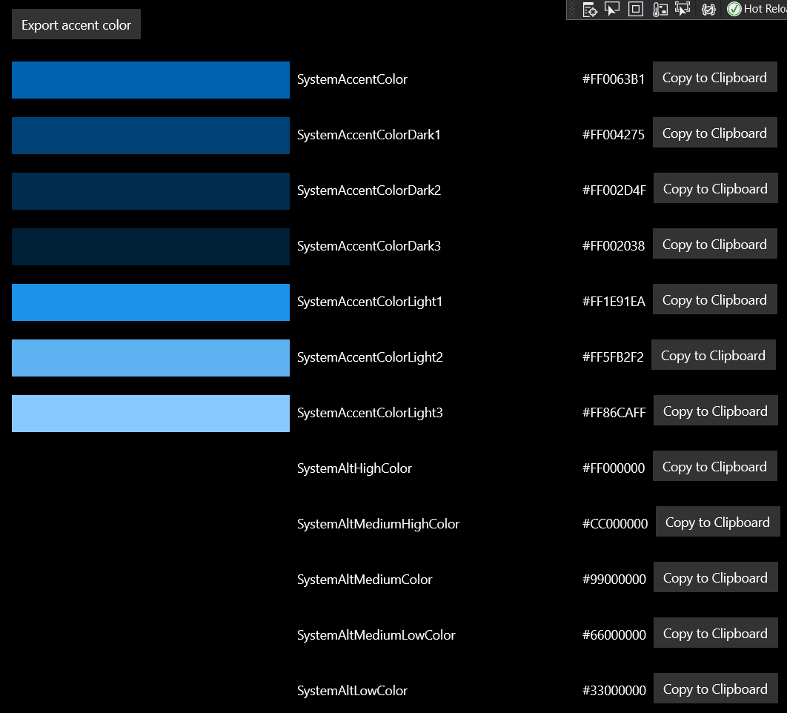

# WinUISystemColors

A Windows Universal App that allows to extract the Windows system colors.

I created this applicataion in order to provide the original colors for my Flutter winui package.
Hence, the export buttons currently export only the Dart code that I need for my plugin to save me time,
but this should be easily extensible.

